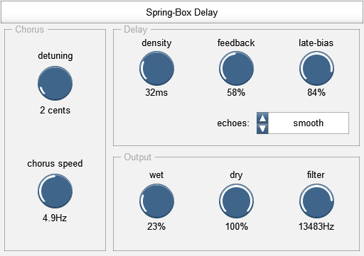
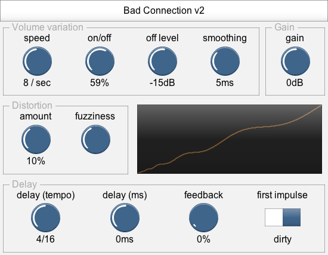
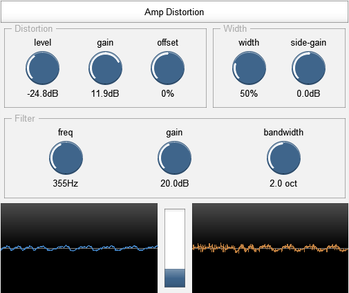
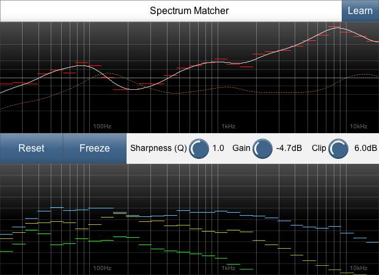
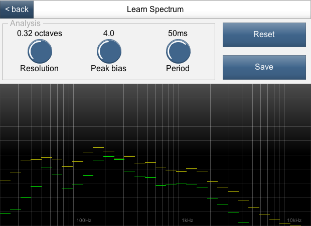

# Geraint's JSFX repository

This is a collection of audio effects I have written in REAPER's JSFX language.

Download them from [GitHub](https://github.com/geraintluff/jsfx) or on [ReaPack](https://reapack.com/) by adding the repository: https://geraintluff.github.io/jsfx/index.xml

* PadSynth - a synth that produces thick sounds, including per-note effects and modulators
* Spring-Box - an echo/reverb effect
* Bad Connection - flips between two volumes to simulate poor connection or dropouts
* Sandwich Amp - distortion module with a before/after filter pair, width control and secondary input
* Spectrum Matcher - analyse the difference between an input and a model, and optionally correct with EQ

Presets (RPL) for these effects can be downloaded from GitHub.

## PadSynth

This is a synth that specialises in smooth and thick sounds, with a bank of effects and assignable modulators that are calculated per-note. ([audio demo](audio-demos/padsynth.mp3))

You can find more information and demos for this synth on its [main project page](https://github.com/geraintluff/jsfx-pad-synth).

The per-note effects can re-ordered and renamed, and the modulators can modulate any later effect in the chain, including other modulators.

## Spring-Box

Spring-Box is an echo/reverb effect based on a matrix of 4 delay lines feeding back into each other.  Early echoes can be suppressed to get a smoother sound, by using two parallel delay structures with different feedback ratios, and subtracting the results.  ([audio demo](audio-demos/spring-box.mp3))

## Bad Connection

Bad Connection is an effect that randomly changes the audio between two volume levels.  It can be used to imitate [dodgy radios](audio-demos/Bad Connection/radio-dropout.mp3) or [glitchy CPU overloads](audio-demos/Bad Connection/cpu-overload.mp3).

## Sandwich Amp

Sandwich Amp is a distortion effect with a set of paired filters on either side, to provide a range of timbres.  ([audio demo](audio-demos/sandwich-amp.mp3))

The underlying distortion function is `tanh()` (which is a fairly "soft" distortion, as opposed to a hard clip), but it can be driven quite hard, and an offset can be added to get asymmetrical response.

The "width" parameter widens the sound before distortion and narrows it afterwards, so that the distortion sounds stable and central while preserving the stereo feel of the sound.  Similarly, the "filter" section applies a filter before the distortion, and then applies the inverse filter afterwards, which can provide distinctive distortion timbres.

It is also possible to supply a secondary input to the effect (channels 3 and 4) - this audio is added in before the distortion, but then subtracted again afterwards.

## Spectrum Matcher

Spectrum Matcher is a tool for comparing the spectrum/timbre of an input against a model, and optionally applying a correction filter.

It can learn new models from the incoming audio, and save this as a preset for later use:

